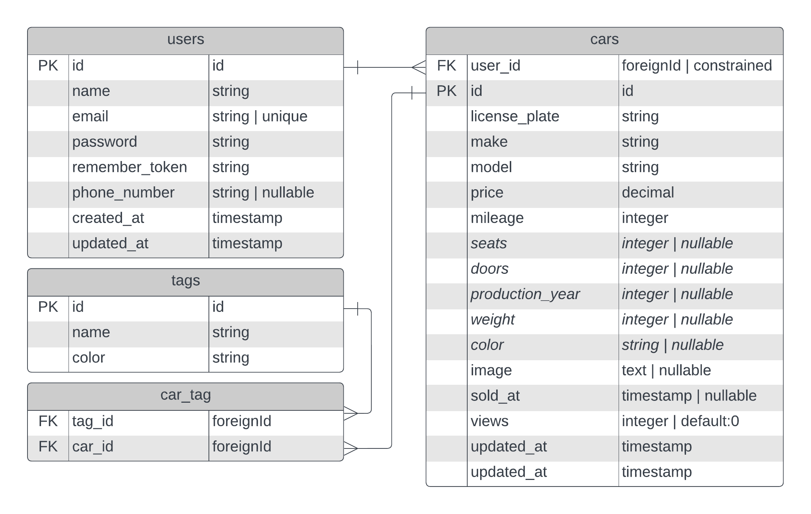

# Installatie
1.	Fork de repo.
2.	Clone jouw kopie van de repository (naar je `C:/laragon/www` map).
3.	Open phpMyAdmin en maak een lege database. Gebruik dezelfde naam als de app.
4.	Ga naar de map van je repository. Kopieer en hernoem de file `.env.example` naar `.env`.
5.	Open je hele map in Visual Studio Code. Open de `.env`-file.
6.	Controleer de waarden voor DB_DATABASE, DB_USERNAME en DB_PASSWORD. Bij DB_DATABASE vul je in ieder geval de naam in van de database die je net hebt gemaakt.
7.	Open een terminal in VS Code en voer achter elkaar de volgende commando’s uit:
    - `composer install` (hiermee installeert composer alle nodige packages)
    - `php artisan key:generate` (hiermee maak je een encryptie key aan)
    - `php artisan migrate` (hiermee maak je de tabellen aan)
    - `npm install` (hiermee installeer je packages die nodig zijn voor de front-end)
    - `npm run dev` (hiermee gaat npm alle CSS en JavaScript files compileren)
8.	Tenslotte: zorg dat Laragon in gestart en gereload en ga naar _naamvanmap_.test.

# ERD
De _schuingedrukte_ velden zijn `nullable` omdat ze later vanuit de RDW API opgehaald kunnen worden.

